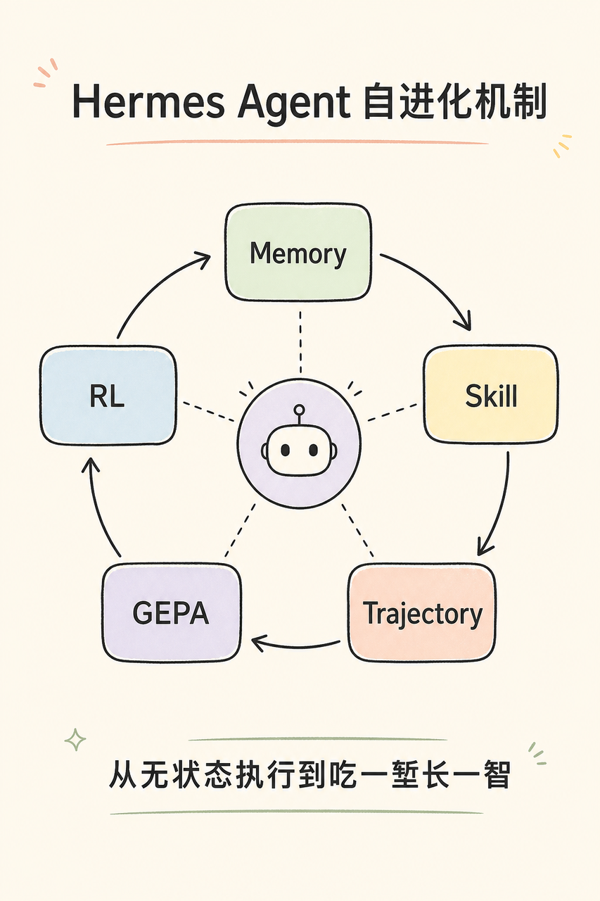
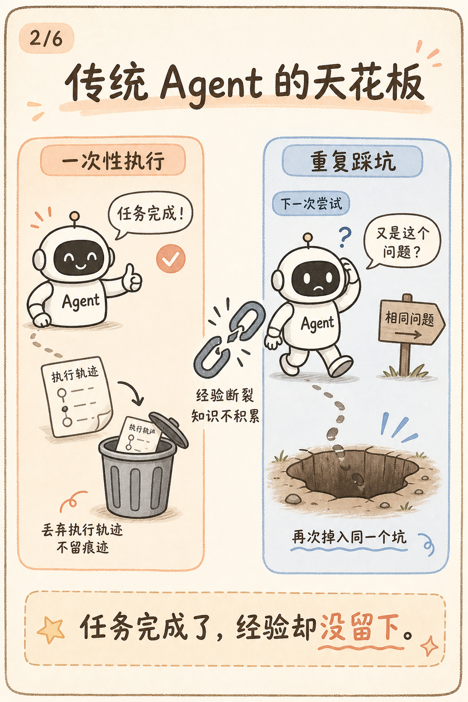

<!--

Source: https://ccn7vpu5l5y8.feishu.cn/wiki/YuKwwFonciCOvqkbOp3cDsgKnid

Exported: 2026-06-07

Extraction: Feishu SSR block_map from public page HTML.

Note: Some image URLs may require an authenticated Feishu browser session.

-->


> Source: https://ccn7vpu5l5y8.feishu.cn/wiki/YuKwwFonciCOvqkbOp3cDsgKnid

> Exported: 2026-06-07


# 字节面试官：聊一聊Hermes Agent 的自进化机制



> 一句话定位：Hermes 的"自进化"不是指模型在每次对话后偷偷改权重，而是做了一个分层的学习闭环——短期靠 Memory 和 Skill 把经验外化，长期靠轨迹数据、RL 或离线优化把经验内化到模型或提示词资产里。这是工程闭环，不是玄学。

---

## 为什么传统 Agent 做不到"自进化"？



OpenClaw、Claude Code 等当代主流 Agent 已经很强：能自主规划、调用工具、完成复杂长周期任务。但它们有一个共同的天花板——无状态执行。

任务执行完后，无论走了多少弯路、踩了多少坑、经过多少次人工纠正，这些宝贵经验大多随对话结束而消散。下次遇到类似任务，Agent 依然可能重蹈覆辙。除非你手动要求它把经验写进 Memory 或 Skill，否则它不会自动"长记性"。

Hermes 的突破就在于通过机制设计，让每一次执行都变成成长的养分，形成真正的自进化闭环。官方文档把它定义为"the only agent with a built-in learning loop"，核心是：

> Agent-curated memory with periodic nudges, autonomous skill creation after complex tasks, skill self-improvement during use, FTS5 cross-session recall with LLM summarization, and Honcho dialectic user modeling.

这个定义很重要：它不只是"生成 Skill + RL"，而是强调四层记忆架构 + 周期性 Nudge + 渐进式 Skill 加载，确保 Token 成本不会随技能增多而爆炸。

---

## 整体架构：分层的学习闭环


> Image token: OCUAbwoj4o52E9xQYg2cHsTdnQc; file: 03-content-loop.png; original image may require a Feishu session.

把 Hermes 的自进化画成一个闭环，大致如下：

```text
用户任务
  ↓
Agent 规划、调用工具、执行任务
  ↓
保存会话与工具轨迹（SQLite + ShareGPT JSONL）
  ↓
后台复盘（Nudge）：哪些事实要进 Memory？哪些流程要变成 Skill？
  ↓
写入/更新 MEMORY.md、USER.md、SKILL.md、Session DB
  ↓
下次遇到类似任务时，自动召回记忆或加载 Skill
  ↓
Curator 定期维护 Skill 库（合并/归档/修补）
  ↓
更长期：把高质量轨迹导出，用 GEPA 离线优化 或 RL 训练内化
  ↓
更强的底层模型 + 更优的 Skill 库 → 产生更高质量轨迹（循环）
```

每一层的成本、风险、生效速度都不同。这个分层设计，比单纯说"我有个长期记忆"要成熟很多。

---

## 第一层：记忆层——事实与偏好的外化


> Image token: PmlqbUTMNoAInZxB5cecupCantc; file: 04-content-memory.png; original image may require a Feishu session.

### 四层混合记忆架构

Hermes 的记忆系统不是一个文件，而是四种互补的存储机制：

① Prompt Memory（始终加载）

两个 Markdown 文件始终注入 system prompt：

> Embedded Feishu sheet block: WydNsJfuohxpP4tTz2ncBxV9nTf_P2SERD

两个文件存放在 ~/.hermes/memories/，在每次会话开始时作为冻结快照注入 system prompt（注意是冻结快照，不是动态更新，这是为了保留 LLM 的前缀缓存，提升性能）。Agent 通过 memory 工具自己增删改记忆条目，修改立即持久化到磁盘，但要到下一个会话才会出现在 system prompt 里。

字符限制是刻意设计的约束——当内存满了，Agent 需要先合并或删除旧条目腾出空间，迫使它做信息提炼，而不是无限堆积。当使用率超过 80%，系统会提示 Agent 在添加新条目前先做整合。

注入格式示例：

```text
══════════════════════════════════════════════
MEMORY (your personal notes) [67% — 1,474/2,200 chars]
══════════════════════════════════════════════
User's project is a Rust web service at ~/code/myapi using Axum + SQLx
§
This machine runs Ubuntu 22.04, has Docker and Podman installed
§
User prefers concise responses, dislikes verbose explanations
```

② Session Search（按需召回）

所有 CLI 和消息平台的会话都存入 SQLite（~/.hermes/state.db），并用 FTS5 全文搜索建索引。这是 episodic 记忆，对应"上周我们怎么修过这个部署问题"这类跨会话回忆。

session_search 工具直接返回数据库中的真实消息，无 LLM 摘要、无截断，可以按会话 ID 向前/向后滚动。这与 Prompt Memory 的区别是：

> Embedded Feishu sheet block: WydNsJfuohxpP4tTz2ncBxV9nTf_jtxFMr

③ Skills（程序性记忆，渐进加载）

Skills 是 Hermes 最核心的记忆层，存放可复用的操作流程知识，详见下一节。关键点在于它采用渐进式加载，默认只加载名称 + 摘要（约 3k tokens），相关时再加载全文，这是控制 Token 成本随 Skill 库增长的关键设计。

④ Honcho 层（可选，辩证式用户建模）

Honcho 是由 Plastic Labs 开发的 AI 原生记忆后端，在 Hermes 内置记忆之上增加了辩证推理和深度用户建模能力。

它不做简单的键值存储，而是对对话进行事后推理，维护一个关于用户是谁的持续模型。核心是"辩证推理"（Dialectic Reasoning）：每隔 dialecticCadence 轮对话，Honcho 会分析对话内容，推导出关于用户偏好、习惯和目标的洞察，随时间积累，形成越来越深的理解——超越用户明确说出来的内容。

Honcho 支持三个正交配置维度：

- contextCadence：基础层上下文刷新频率（默认每轮）

- dialecticCadence：辩证推理刷新频率（默认每 2 轮）

- dialecticDepth：每次辩证推理的推理深度（1-3 轮，深度 >1 时有自我审计和矛盾调和）

还支持多 Agent 隔离：当多个 Hermes 实例与同一用户交互时（如编程助手和个人助手），Honcho 为每个实例维护独立的用户画像，防止上下文污染。

这一层适合长期个人助理场景，对短期任务自动化意义不大。

### 什么时候自动写入记忆？

Agent 会主动保存（无需用户要求）：

- 用户纠正了它的做法（"别用 sudo，用户在 docker group 里"）

- 发现了项目约定（"这个项目用 tabs，120 字符行宽"）

- 记住了环境事实（"staging 服务器用 port 2222，不是 22"）

- 用户明确的偏好（"我更喜欢 TypeScript 而不是 JavaScript"）

不会写入：模糊无用信息、容易重新查询的内容、大段代码或日志、临时调试上下文。

---

## 第二层：Skill 层——流程经验的外化与自改进


> Image token: SJ7tbNcNmoaLf8x5DXac8jDVnNf; file: 05-content-skill.png; original image may require a Feishu session.

### 从"静态 Skill"到"动态 Skill"

OpenClaw 和 Claude Code 也支持 Skill，但本质上是静态安装模式：用户或开发者预先写好，安装后不会自动变化。更像传统 APP 软件——需要先发布、安装才能运行。

Hermes 将 Skill 变成了动态的、可进化的资产，通过以下机制实现：

### 触发机制：Nudge 计数器 + 后台审查 Agent

Nudge 计数器：run_agent.py 里有个 _iters_since_skill 计数器，记录距上次使用 skill_manage 工具经过了多少轮。当连续 _skill_nudge_interval = 10 轮没有创建/修改 Skill 时，系统会主动"提醒"Agent 整理经验。这是一种定期 Nudge 而不是记录一切——不是每轮都写，也不是什么都不写，而是有节奏地沉淀。

后台审查 Agent（异步进化）：每当主 Agent 完成对用户的回复后，Hermes 通过 _spawn_background_review 在后台异步 Fork 一个轻量级审查 Agent，专门对刚结束的对话进行深度复盘。这个后台 Agent 不干扰前台用户体验，从三个维度审查：

- 记忆审查（_MEMORY_REVIEW_PROMPT）：这段对话有什么值得长期记住的经验/事实？判断是否值得写入 MEMORY.md 或 USER.md。

- 技能审查（_SKILL_REVIEW_PROMPT）：这个任务模式是否具有通用性，是否值得抽象成可复用的 Skill？

- 综合审查（_COMBINED_REVIEW_PROMPT）：整个执行过程有什么优化空间或潜在错误模式？

典型触发创建 Skill 的场景：完成了 5+ 工具调用的复杂任务、经历错误恢复后找到正确路径、用户纠正了 Agent 的做法、发现了非显而易见的工作流。

这种"前台即时响应、后台异步进化"的设计，既不影响用户体验，又确保每次交互都积累了结构化资产。

### Skill 的数据结构

每个 Skill 是一个 SKILL.md 文件，遵循 agentskills.io 开放标准，包含 YAML frontmatter（名称、描述、版本、平台限制、条件激活规则、配置项等）和正文（触发条件、操作步骤、常见坑、验证方式）。

```text
~/.hermes/skills/
├── mlops/axolotl/
│   ├── SKILL.md          ← 主入口（必须）
│   ├── references/       ← 参考文档（按需加载）
│   ├── templates/        ← 输出模板
│   ├── scripts/          ← 可调用的辅助脚本
│   └── assets/           ← 补充文件
├── devops/deploy-k8s/    ← Agent 自动创建的 Skill
│   └── SKILL.md
└── .hub/                 ← Skills Hub 状态
```

渐进式加载（Token 控制关键）：

```text
Level 0: skills_list()          → [{name, description, category}, ...]   (~3k tokens)
Level 1: skill_view(name)       → 完整内容 + 元数据
Level 2: skill_view(name, path) → 指定支撑文件
```

Agent 只在真正需要时才加载 Skill 全文，这是控制 Token 成本随 Skill 库增长的关键。100 个 Skill 的目录只占约 3k tokens，而不是 100 × 完整描述。

条件激活：Skill 可以根据当前工具集的可用性自动显示或隐藏。例如内置的 duckduckgo-search Skill 声明了 fallback_for_toolsets: [web]——当 web 工具集（需要 API key）可用时，该 Skill 自动隐藏；当 API key 缺失时，它自动出现作为降级方案。这让 Skill 目录根据运行环境自适应。

自改进机制：后续执行新任务时，如果发现了更优路径或新的边界情况，Agent 通过 skill_manage 工具的 patch 操作（而非 edit 全量覆写）更新 Skill——这比全量编辑更高效、Token 更友好。随着对话越来越多，Skill 越用越精准，能力库动态增长。

一个接地气的例子：假设 Hermes 第一次帮你部署一个服务，过程中发现"这个项目不能直接 npm run build，必须先生成 Prisma client；Docker 镜像要带某个环境变量；最后用健康检查接口验证"。普通 Agent 下次还可能重新踩坑。Hermes 的思路是把这套流程写成一个 Skill，下次遇到类似部署任务，不是从零推理，而是先加载这个 Skill，像工程师翻自己的 runbook。

### Curator：Skill 库的后台园丁

随着 Agent 自动创建越来越多的 Skill，一个新问题出现了：Skill 会无限堆积、产生近似重复、出现过时内容。

Curator 是 Hermes 专门解决这个问题的子系统，是一个针对 Agent 自创 Skill 的后台维护机制。它追踪每个 Skill 被查看、使用和更新的频率，通过 active → stale → archived 状态机进行自动迁移，并定期启动轻量辅助模型审查、合并或修补偏离的 Skill。

运行机制：由惰性检查触发，不是 Cron 守护进程。满足两个条件时才启动：距上次运行超过 interval_hours（默认 7 天），且 Agent 已足够空闲（min_idle_hours，默认 2 小时）。启动后 Fork 一个后台 AIAgent，两阶段执行：

- 自动状态迁移（确定性，无需 LLM）：30 天未使用变为 stale；90 天未使用归档到 ~/.hermes/skills/.archive/。

- LLM 审查（单次辅助模型，max_iterations=8）：扫描所有自创 Skill，决定每个 Skill 是保留、修补、合并重叠 Skill，还是归档。

安全设计：Curator 永远不触碰随 repo 分发的 bundled skills 或从 agentskills.io 安装的 hub skills，只处理 Agent 自己创建的 Skill。永远不自动删除——最坏结果是归档，可以用 hermes curator restore <skill> 恢复。每次真正执行前都会自动做 tar.gz 快照，支持 hermes curator rollback 一键回滚。

支持 hermes curator run --dry-run 预览变更但不执行，hermes curator pin <skill> 保护重要 Skill 不被处理。

---

## 第三层：轨迹层——结构化经验的沉淀


> Image token: HqvwbNEe9oENDIxD7jZcJeAbnQf; file: 06-content-trajectory.png; original image may require a Feishu session.

Hermes 会把一次 Agent 执行过程完整保存为轨迹（Trajectory）：system prompt、用户请求、模型回复、工具调用、工具结果、最终答案。

轨迹以 ShareGPT 兼容的 JSONL 格式保存，成功样本写入 trajectory_samples.jsonl，失败或中断样本写入 failed_trajectories.jsonl：

```json
{
  "conversations": [
    {"from": "system", "value": "你是 Hermes Agent..."},
    {"from": "human", "value": "帮我部署这个应用"},
    {"from": "gpt", "value": "好的，我先检查环境..."},
    {"from": "tool", "value": "<tool_call>execute_code(...)</tool_call>"},
    {"from": "tool", "value": "<tool_response>成功</tool_response>"},
    {"from": "gpt", "value": "部署完成！"}
  ],
  "timestamp": "2025-04-11T10:30:00",
  "model": "anthropic/claude-opus-4.6",
  "completed": true
}
```

为什么用 gpt 这个标签而不是 assistant？这是历史遗留的行业约定。LLaMA-Factory、FastChat、OpenChat 等主流训练框架都用这个格式，训练时框架会把 from: gpt 映射到对应模型的 chat template。单方面改掉反而不兼容。

---

## 第四层：进化层——GEPA 离线优化 + RL 权重内化


> Image token: ITYQb4uccoOG0zx49oFcYk9lnwc; file: 07-content-evolution.png; original image may require a Feishu session.

### GEPA + DSPy：无 GPU 的文本级进化

Nous 有一个独立仓库 hermes-agent-self-evolution，使用 DSPy + GEPA（Genetic-Pareto Prompt Evolution，ICLR 2026 Oral） 对 Skill、工具描述、System Prompt、代码进行进化式优化。

工作流程：

```text
读取当前 Skill/Prompt/工具描述
      ↓
生成评估数据集
      ↓
GEPA 优化器 ←── 真实执行轨迹
      ↓            （不只知道失败，还理解"为什么失败"）
候选变体 ──► 评估
      ↓
选出最优变体 → 提交 PR
```

核心优势：基于真实执行轨迹进行反思式变异（reflective evolutionary search），不需要 GPU，完全通过 API 调用——变异文本、评估结果、选择最优变体。每次优化运行成本约 2-10 美元。样本效率远高于传统 RL（GEPA 通常只需 100-500 次评估，而 GRPO 类可能需要上万）。

重要的是，PLAN.md 中明确说明这个 pipeline 是"operate ON hermes-agent — not part of it"——它更像一个外部进化器，在主 Agent loop 之外运行，定期把优化后的 Skill 和 Prompt 作为 PR 提交，保持可审查性。

GEPA 适合日常持续优化，RL 适合研究级深度内化，两者互补。

### RL 训练闭环：权重层面的内化

如果说动态 Skill 生成解决的是"下次别再踩同一个坑"，那么 RL 训练解决的是更深一层的问题：能不能让模型不用每次都翻笔记，而是把某类能力真正练进权重里。

Skill、Memory、Session Search、Context Injection，本质上都是 Context Engineering 或外部资产管理。它们很有效，也很工程友好，因为 Markdown 可读、可改、可回滚。但它们并不会改变模型本身。模型下次表现更好，是因为它被喂进了更好的上下文，而不是因为它真的"学会了"。所以从严格意义上说，Skill 更像"外挂知识库"或"工程经验本"，而 RL 才是把经验压进模型参数里的"内功训练"。

Hermes 把自己称为 research-ready，不只是因为它能跑模型训练，而是因为它把 Agent 执行过程中的几个关键环节串了起来：批量生成轨迹、压缩轨迹、构造环境、定义奖励、启动训练、监控指标、拿到权重产物。更准确地说，Hermes 把 RL 训练做成了一个 Agent 可操作的 MLOps 闭环：

```text
任务目标
  ↓
构造 Prompt / Benchmark / 历史轨迹
  ↓
batch_runner.py 批量跑 Agent，生成 ShareGPT 轨迹
  ↓
trajectory_compressor.py 压缩长轨迹，保留头尾关键信号
  ↓
Environment 定义任务、数据集、prompt 格式和 score_answer
  ↓
Atropos 管理 rollout group、环境交互和优势估计
  ↓
Tinker 负责 LoRA 权重训练、采样推理和 optimizer step
  ↓
WandB / eval metrics 判断模型是否真的变强
  ↓
产出新 adapter / 新模型
  ↓
重新部署到 Hermes，进入下一轮任务执行
```

这个训练系统里最关键的三个角色是 Atropos、Tinker、Environment：

- Atropos：轨迹 API server，负责协调环境交互、管理 rollout group，并计算优势。

- Tinker：真正动权重的训练后端，负责 LoRA 权重训练、采样推理和优化器步骤。

- Environment：规则层，定义这次到底要学什么、数据从哪里来、答案如何评分、奖励如何返回。

换句话说，Hermes 不是让主 Agent 在聊天时直接改自己的权重，而是让主 Agent 去操控一个训练系统：先发现有哪些环境，读环境源码，理解数据集和评分逻辑，再编辑配置，先跑 inference test，确认 reward 和解析逻辑没问题，最后再启动长时间训练。这一点体现在 rl_cli.py 的提示词设计里：discover、inspect、inspect data、create、configure、test、train、evaluate，而且特别强调 Always test before training。因为训练一旦启动就是长任务，配置错了会直接烧钱烧时间。

完整 Pipeline：

① 批量数据合成（batch_runner.py）

并行处理大量提示词，每条提示词运行完整 Agent 对话：

- 默认用 Claude Opus 等强模型作为 Teacher 模型，生成高质量示范轨迹

- 工具集随机采样：每次运行随机不同工具组合，让模型学会灵活运用而非死记固定配置

- 零推理过滤：如果 <REASONING_SCRATCHPAD> 和 reasoning 字段都为空，直接丢弃——没有思考过程的轨迹对训练无价值

还有 mini_swe_runner.py 专门处理软件工程 Benchmark 任务，完成信号为 echo "MINI_SWE_AGENT_FINAL_OUTPUT"。

这一步看似普通，其实非常关键。Agent 训练和普通聊天模型训练不一样，普通 SFT 只要"问题—答案"就够了，但 Agent 要学的是"什么时候规划、什么时候调用工具、工具失败后怎么修正、最后怎么验证"。所以 Hermes 保存的不只是最终答案，而是完整执行过程：

```json
{
  "prompt_index": 42,
  "conversations": [
    {"from": "human", "value": "Debug this error..."},
    {"from": "gpt", "value": "I'll inspect the logs first...", "tool_calls": []},
    {"from": "tool", "value": "..."},
    {"from": "gpt", "value": "The issue is fixed..."}
  ],
  "metadata": {
    "batch_num": 2,
    "timestamp": "2026-01-15T10:30:00",
    "model": "anthropic/claude-sonnet-4.6"
  },
  "completed": true,
  "toolsets_used": ["terminal", "file"],
  "tool_stats": {
    "terminal": {"count": 2, "success": 2, "failure": 0}
  }
}
```

工具集随机采样让训练数据覆盖更多工具组合，而不是让模型死记"某类任务永远配某组工具"。零推理过滤也很重要，因为 Agent 轨迹里最值钱的不是"最后说对了"，而是"它为什么这么做"。如果一个样本没有显式推理，也没有可解释的决策过程，那么它对训练 tool-calling agent 的价值会大幅下降。

② 轨迹压缩（trajectory_compressor.py）

原始轨迹可能几十万 Token，直接训练不现实。压缩目标约 15,250 Token（使用 HuggingFace Tokenizer 精确计数）。

策略是"头尾保护 + 中间摘要"：

> Embedded Feishu sheet block: WydNsJfuohxpP4tTz2ncBxV9nTf_g298qe

为什么保护头尾？头部包含任务定义，没有它模型不知道在做什么；尾部包含最终答案，没有它训练信号不完整；中间是大量试错探索，一句话摘要就够了。

这里要区分实时 Context Compressor 和离线 Trajectory Compressor。实时压缩是为了让当前对话继续跑下去，目标是运行稳定；轨迹压缩是为了让训练样本更干净，目标是训练有效。前者服务推理，后者服务学习。压缩不是单纯为了省 token，而是为了保留训练信号的结构完整性：案由和判决书必须完整，中间庭审笔录可以摘要。

③ Environment：RL 的题目和考官

很多人讲 RL 容易只讲算法，比如 GRPO、PPO、DPO，但在 Agent 场景里，真正决定训练有没有用的往往是 Environment。Hermes 的自定义 RL 环境需要定义数据加载、题目生成、答案评分和轨迹回传，大致可以理解成：

```python
class MyAgentEnv(BaseEnv):
    def load_dataset(self):
        # 训练数据从哪里来：GSM8K、HumanEval、SWE-Bench、业务数据集等
        ...

    def get_next_item(self):
        # 下一道题怎么取，prompt 怎么构造
        ...

    def score_answer(self, item, answer):
        # 模型回答怎么打分：规则、单测、编译、LLM judge、人工反馈等
        ...

    def collect_trajectories(self):
        # 把 rollout、score、metadata 打包回训练系统
        ...
```

这也是为什么 Hermes 的 RL 部分更接近"研究就绪"而不是"微调按钮"。它允许你把一个业务问题写成一个可训练环境。数学任务可以用标准答案评分；代码任务可以跑单测；SWE 任务可以看 patch 是否修复 issue；搜索任务可以验证引用是否真实；内部业务任务可以把数据库一致性、接口返回、审批规则写进 reward。

所以，RL 训练不是让模型泛泛地变聪明，而是让模型在某个可验证环境中形成更稳定的行为策略。

④ 渐进式 RL 训练（rl_cli.py）

标准工作流：rl_list_environments() → 选择环境 → rl_get_current_config() 查看参数 → rl_edit_config() 配置 → 必须先执行 rl_test_inference 验证 → rl_start_training() 启动训练 → rl_check_status() 监控（限速 30 分钟/次） → rl_get_results() 获取结果。

rl_start_training() 启动三个进程，有错开的延迟（API 5 秒、训练器 30 秒、环境再延迟 90 秒）以确保正确的初始化顺序：

- Atropos API Server（轨迹协调）

- Tinker Trainer（LoRA 训练 + FastAPI 推理服务，端口 8001）

- Environment（连接 Atropos 的任务环境）

关键参数：

```toml
RL_MAX_ITERATIONS = 200
DEFAULT_MODEL = "anthropic/claude-opus-4.6"
group_size = 16          # 每个问题生成的回答数量
lora_rank = 32
learning_rate = 4e-5
max_token_length = 8192
```

rl_cli.py 的核心思想可以简化成下面这段伪代码：

```python
# rl_cli.py 的核心思想，不是原样源码
RL_MAX_ITERATIONS = 200
RL_TOOLSETS = ["terminal", "web", "rl"]

workflow = [
    "rl_list_environments",
    "read environment files",
    "inspect dataset format",
    "rl_select_environment",
    "rl_edit_config",
    "rl_test_inference",   # 先小规模验证
    "rl_start_training",   # 再正式训练
    "rl_check_status",
    "rl_get_results",
]
```

这个设计很有意思，因为它把"训练模型"这件原本需要 ML 工程师手工操作的事情，包装成了 Agent 自己能理解、能检查、能分步执行的工具链。以前我们说 Agent 调工具，通常是调搜索、终端、文件系统；Hermes 这里更进一步：Agent 调用的是训练基础设施本身。

正式训练时，rl_start_training() 不是离线地拿一份 JSONL 做一次 SFT，而是启动 Atropos API server、Tinker trainer 和 Environment 三个协同进程，形成更接近 on-policy 的循环：

```text
当前策略模型生成答案
  ↓
环境打分
  ↓
Atropos 聚合 rollout group
  ↓
Tinker 根据 advantage 更新 LoRA
  ↓
新权重用于下一轮采样
  ↓
继续生成、评分、更新
```

这就是"权重内化"的核心。模型不是只背诵 teacher 轨迹，而是在环境反馈中调整自己的策略。

⑤ GRPO 算法与多维奖励设计

使用 GRPO（Group Relative Policy Optimization，DeepSeek R1 提出）：对同一个问题让模型生成 8-16 个不同回答，用奖励函数打分，让模型学习"多产出高分回答、少产出低分回答"。

关键优势是不需要单独训练 Reward Model，直接用规则化奖励函数。奖励函数还能通过 ToolContext 执行真实验证：编译代码判断对错、读文件确认修改、访问网络验证结果——而不只是文本匹配。

奖励函数设计黄金法则（来自 /skills/mlops/training/grpo-rl-training/SKILL.md）：

> Embedded Feishu sheet block: WydNsJfuohxpP4tTz2ncBxV9nTf_CtRmy2

设计原则：组合 3-5 个奖励函数，每个管一个方面；先单独测试每个，再合起来用；给部分分，不要只有 0/1 的二值奖励。

这可以用一个代码修复任务的奖励函数来理解：

```python
def reward_code_fix(output, tool_context):
    score = 0.0

    # 1. 格式奖励：是否给出清晰 reasoning 和 final answer
    if "<reasoning>" in output and "<answer>" in output:
        score += 0.5

    # 2. 行为奖励：是否真的修改了文件，而不是只口头解释
    changed = tool_context.run("git diff --name-only")
    if "src/" in changed:
        score += 0.5

    # 3. 正确性奖励：单测是否通过
    test = tool_context.run("pytest -q", timeout=120)
    if test.exit_code == 0:
        score += 2.0

    return score
```

这个例子背后的重点是：Hermes 的 reward 不应该只奖励"答案看起来漂亮"，而应该奖励"任务状态真的变好了"。如果训练代码修复 Agent，最终 reward 最好来自测试、编译、lint、diff、运行结果，而不是只看模型有没有说"我已经修好了"。

⑥ RL 训练的真实目的：知识蒸馏而非从用户学习

RL 训练的核心不是"从用户对话学习"，而是知识蒸馏——把 Claude Opus 这类大模型的 Agent 能力压缩到 Qwen 3-4B 这类小模型里。三个动机：

- 降本：本地小模型推理免费，Claude Opus API 调用费用不低

- 提速：小模型推理延迟更低

- 合规：本地模型数据不出机器，满足安全合规要求

通过 RL 的奖励机制，开源小模型在特定垂直领域有机会接近甚至超过更大参数闭源模型的水平。

为什么不直接用用户对话数据训练？

两个原因：隐私问题（对话可能含敏感信息）；以及更关键的质量问题——用户对话质量参差不齐，直接训练大概率"训废"模型。正确做法是把历史对话当成"原材料"，而不是"训练成品"：

```text
历史用户轨迹
  ↓
脱敏 / 去密钥 / 去隐私
  ↓
筛选成功任务与高质量纠错样本
  ↓
Teacher Model 复盘与重写
  ↓
构造成可验证任务或偏好样本
  ↓
进入 Environment / Reward 体系
  ↓
RL 或 SFT 训练
```

这个边界一定要讲清楚。Hermes 的 RL 训练更像是"受控数据闭环"，而不是"裸用户数据闭环"。它不是默认把所有用户对话直接喂给训练器，而是把训练过程放在可配置、可测试、可评估的 RL toolset 里。

⑦ 评估与回滚：自进化是否可信的门槛

自进化不能只看训练是否完成，还要看评估是否变好。WandB 里的 train/loss、reward/mean、advantages/mean、advantages/std、logprobs/diff 等指标不是装饰品，而是判断模型有没有真的学到东西的体温计。

如果 reward/mean 上升，但 eval accuracy 不升，可能是 reward 被模型钻空子了；如果 train loss 很漂亮，但 logprobs drift 太大，可能说明模型偏离参考策略过快；如果 advantage 标准差长期接近 0，可能说明 reward 区分度不够；如果测试环境过于简单，模型可能只是 benchmark 过拟合。

所以 Hermes 的 RL 闭环最好理解成：

```text
训练不是终点
评估才是门槛
部署不是终点
下一轮真实任务表现才是验证
```

模型不是训练完就自动变强，而是要经过环境设计、reward 设计、实验监控、离线评估、上线验证、失败回滚这一整套流程。否则所谓自进化很容易变成"自我污染"。

小结

Hermes 的 RL 训练闭环真正高级的地方，不是它能按一个按钮微调模型，而是它把 Agent 的执行经验变成了一种可训练资产。batch_runner.py 负责把任务执行过程录下来，trajectory_compressor.py 负责把长轨迹压成可训练样本，Environment 负责定义任务和评分标准，Atropos 负责组织 rollout 和优势估计，Tinker 负责真正更新 LoRA 权重，WandB 和评估集负责判断这次更新有没有价值。只有这几环全部闭合，所谓"自进化"才不是一句营销词，而是一个可以复现、可以调试、可以回滚的工程系统。

---

## 四层的对比视角

> Embedded Feishu sheet block: WydNsJfuohxpP4tTz2ncBxV9nTf_oFqtf2

---

## 与 OpenClaw 的本质差异


> Image token: O85PbpuTSoNTBax32hoc5lcNnHf; file: 08-content-difference.png; original image may require a Feishu session.

> Embedded Feishu sheet block: WydNsJfuohxpP4tTz2ncBxV9nTf_K2RTn5

---

## 面试金句


> Image token: HbtBbgUCXorL6bxYu3GctXednYb; file: 09-ending-quote.png; original image may require a Feishu session.

Hermes 的自进化，本质是把 Agent 的一次性执行过程资产化。Memory 负责记住事实，Skill 负责记住流程，Trajectory 负责沉淀训练数据，RL/GEPA 负责把这些经验进一步转成模型能力或提示词能力。它不是靠"聊天越多模型自动变聪明"这种玄学，而是靠可存储、可检索、可评估、可训练的工程闭环。

核心架构判断：Hermes 把"学习"拆成了不同成本、不同风险、不同生效速度的层次。Memory 生效最快，但容量小，适合事实和偏好；Skill 稍重一些，但可解释、可编辑，适合流程经验；GEPA 无需 GPU，适合系统性提升 Skill 和 Prompt 质量；RL 成本最高，但一旦成功就能把能力内化进模型。这个分层设计，比单纯说"我有个长期记忆"要成熟很多。

---

## 参考资料

- Hermes Agent 官方文档：https://hermes-agent.nousresearch.com/docs/

- Skills System：https://hermes-agent.nousresearch.com/docs/user-guide/features/skills

- Persistent Memory：https://hermes-agent.nousresearch.com/docs/user-guide/features/memory

- Honcho Memory：https://hermes-agent.nousresearch.com/docs/user-guide/features/honcho

- Curator：https://hermes-agent.nousresearch.com/docs/user-guide/features/curator

- RL Training：https://hermes-agent.nousresearch.com/docs/user-guide/features/rl-training

- hermes-agent-self-evolution：https://github.com/NousResearch/hermes-agent-self-evolution

- Atropos RL Framework：https://github.com/NousResearch/atropos
