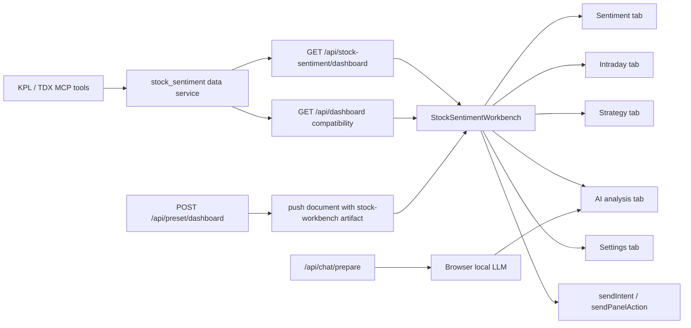

# A股情绪工作台 1:1 迁移设计

> 日期：2026-06-22  
> 状态：待 spec review  
> 来源：brainstorming 产出，用户已批准“方案 A：集成式 1:1 迁移”

## 1. 背景与目标

旧版 `https://lisonevf-sentiment.hf.space/dashboard/` 是本项目的上一代“市场情绪工作台”。它不是单个看板，而是一个完整的 A 股情绪产品面：左侧情绪对话、右侧五个工作台页签、实时行情数据、盘中执行流程、明日策略、AI 研判、设置与浏览器本地 LLM 调度。

当前云梭仓库已经有一个较小的 `stock-sentiment` 预设，入口为 `POST /api/preset/dashboard`，后端由 `apps/api/app/stock_dashboard.py` 生成少量 AIRUI 卡片，前端通过 `row-artifacts` 进入通用 ArtifactGallery。这个预设只覆盖旧版的一小段功能，无法满足“上一代版本 1:1 迁移”。

本设计目标是：在当前云梭 Console 内新增“股票情绪工作台”能力，保留旧版可观察功能、数据契约和交互流程，同时复用当前云梭的 AIRUI、聊天、intent、设置与主题体系。迁移标准是功能与工作流 1:1；视觉外壳遵循当前云梭产品 UI，而不是逐像素复制旧版页面。

## 2. 证据与旧版功能面

截至 2026-06-22，旧版 `/api/dashboard` 返回 13 个顶层域：

```text
meta, overview, kpis, indexes, trend, plates, methods, risks,
opportunities, watchlist, monitor, intraday, raw
```

旧版实时数据规模样本：

| 域 | 数量 |
|---|---:|
| indexes | 7 |
| trend | 30 |
| plates | 10 |
| methods | 6 |
| risks | 1 |
| opportunities | 3 |
| watchlist | 1 |
| monitor | 20 |
| intraday.gates | 4 |
| intraday.phases | 4 |
| intraday.candidates | 6 |
| intraday.alerts | 4 |

旧版 HTML 中确认存在的后端/前端能力：

| 能力 | 旧版标识 |
|---|---|
| 情绪数据 | `/api/dashboard` |
| 聊天上下文准备 | `/api/chat/prepare` |
| 配置 | `/api/config` |
| 技能列表 | `/api/skills` |
| AIRUI WebSocket | `/ws/airui?session=default` |
| 情绪页 | `renderSentiment` |
| 盘中页 | `renderIntraday` |
| 明日策略页 | `renderStrategy` |
| AI 研判页 | `renderAiView`, `buildAiDashboardDoc` |
| 设置页 | `renderSettings`, `renderLocalLlmPanel` |
| 本地 LLM | `runClientLlmTurn`, `streamLocalLlmChat` |
| 卡片交互 | `openInteractionPicker`, `sendInteractionPrompt` |

旧版界面标签确认包含：

- 左侧：`SENTIMENT AI`、`市场情绪对话`、`深度分析`、`盘中盯盘`、`仓位建议`、`明日计划`
- 顶部页签：`情绪仪表盘`、`盘中盯盘`、`明日策略`、`AI 研判`、`设置`、`刷新`
- 情绪页：`市场情绪仪表盘`、`情绪周期三线监控`、`板块情绪热力分布`、`风险提示`、`板块强度 TOP8`
- 盘中页：`盘中盯盘流程`、`盘中时间闸口`、`情绪变化预警`、`候选股队列`、`生成操作单`、`仅复核`
- 策略页：`情绪周期定位`、`板块梯队复盘`、`核心指数监控`、`赚钱手法分析`、`明日风险 Checklist`、`明日机会 Watchlist`、`明日观察池`
- 设置页：`主题`、`管理员`、`浏览器 LLM 调度`、`本地 LLM`、`保存本地配置`

## 3. 范围

### 纳入

1. 旧版 `/api/dashboard` 数据契约在新版中可用。
2. 新版保留兼容端点 `GET /api/dashboard`，并新增内部推荐端点 `GET /api/stock-sentiment/dashboard`。
3. 当前 `POST /api/preset/dashboard` 改为启动完整股票情绪工作台，而不是只推送零散卡片。
4. 新版主区迁移旧版五个页签：情绪仪表盘、盘中盯盘、明日策略、AI 研判、设置。
5. 左侧聊天保留旧版快捷问题，并接入当前云梭 ChatPanel。
6. 旧版卡片交互选择器能力迁移为“拆解 / 执行预案 / 风险复核 / 自定义追问”，并映射到当前结构化 intent。
7. 候选股操作迁移“生成操作单 / 仅复核”。
8. 浏览器本地 LLM 调度迁移，保留旧版 OpenAI-compatible local endpoint 配置。
9. 管理员高级设置、主题、技能启用配置迁移到当前设置体系。
10. API、前端 build、浏览器截图和关键交互都需要验证。

### 不纳入

1. 不重建旧版的独立静态 `/dashboard/` 单页作为长期主入口。
2. 不依赖旧版线上 Hugging Face endpoint 作为新版生产数据源。
3. 不逐像素复制旧版视觉样式；新版使用云梭现有产品 UI token、侧栏、状态栏和组件习惯。
4. 不新增证券交易、下单或账户接入能力。所有“操作单”仍是分析和计划生成。

## 4. 目标架构

采用方案 A：集成式工作台。



### 后端边界

新增 `apps/api/app/stock_sentiment/` 包：

| 模块 | 职责 |
|---|---|
| `sources.py` | 调用 KPL/TDX MCP 工具，统一解析 envelope、JSON 字符串、异常 |
| `models.py` | 定义 dashboard 数据契约，优先用 Pydantic 或 TypedDict |
| `service.py` | 组装旧版 13 个顶层域，派生情绪、策略、盘中候选和风险 |
| `airui.py` | 生成固定的 `stock-workbench` artifact wrapper |
| `llm_prepare.py` | 生成 `/api/chat/prepare` 需要的市场快照与消息上下文 |

现有 `apps/api/app/stock_dashboard.py` 不再继续膨胀。它可以保留为兼容层，内部调用新的 service/airui。

### preset 启动契约

`POST /api/preset/dashboard` 的唯一职责是把当前会话主区切到股票情绪工作台。它不再推送旧的多张普通 Widget 卡片。

后端通过 WebSocket `push_document` 写入一个固定 artifact：

```jsonc
{
  "type": "Row",
  "ref": "row-artifacts",
  "children": [
    {
      "type": "Widget",
      "ref": "stock-workbench",
      "props": {
        "title": "A股情绪工作台",
        "colSpan": 12,
        "workbench": "stock-sentiment"
      },
      "children": [
        {
          "type": "Custom",
          "props": {
            "component": "StockSentimentWorkbench"
          }
        }
      ]
    }
  ]
}
```

前端 `collectArtifactPanels` 识别 `widget.ref === "stock-workbench"` 或 `widget.props.workbench === "stock-sentiment"` 时，返回一个专用 `ArtifactPanel`，由 `ArtifactGallery` 渲染 `StockSentimentWorkbench`。其他 artifact 仍走原有通用渲染路径。

`POST /api/preset/dashboard` 响应：

```json
{ "ok": true, "title": "A股情绪工作台", "workbench": "stock-sentiment" }
```

这个契约让启动路径只有一种：preset -> stock-workbench artifact -> 专用 React 工作台。

### 前端边界

新增 `apps/console/src/stock-sentiment/`：

| 模块 | 职责 |
|---|---|
| `types.ts` | 与后端 dashboard 契约对应的类型 |
| `api.ts` | 拉取 dashboard、刷新、chat prepare、local LLM 配置 |
| `StockSentimentWorkbench.tsx` | 五页签容器、刷新、loading/error/snapshot 状态 |
| `SentimentTab.tsx` | 情绪仪表盘 |
| `IntradayTab.tsx` | 盘中盯盘 |
| `StrategyTab.tsx` | 明日策略 |
| `AiAnalysisTab.tsx` | AI 研判和 AIRUI 动态面板 |
| `SentimentSettingsTab.tsx` | 主题、管理员、本地 LLM、技能 |
| `interaction.ts` | 卡片操作、候选股操作到 current intent 的映射 |

`ArtifactGallery` 继续服务通用 artifact。股票情绪工作台作为一个专用 workspace surface 渲染，避免把五个业务页拆成几十张无状态卡片。

## 5. 数据契约设计

新版必须提供与旧版兼容的 dashboard JSON。字段缺失时允许值为空或列表为空，但 key 必须存在。

### 5.1 数据源与派生规则

新版不能依赖旧版 Hugging Face 服务，但必须复刻旧版字段语义。数据服务按以下优先级取数：

| 字段组 | 主要来源 | 说明 |
|---|---|---|
| `meta` | 服务端时间 + 数据源状态 | `day` 使用交易日或当前日期；`warnings` 聚合 MCP/解析失败 |
| `overview` | `kpl.emotion_today` + 派生规则 | `cycle/sentiment/advice/style/timePlan` 由情绪分、涨跌停、炸板率、封板率派生 |
| `kpis` | `kpl.emotion_today`, 历史情绪接口 | 涨停、跌停、封板率、炸板率、溢价、首板/连板、市场温度 |
| `indexes` | `tdx.get_index_overview` | 核心指数行情，字段归一为旧版 index shape |
| `trend` | 历史情绪/涨停表现接口 | 约 30 个交易日；不足时返回可用长度并写 warning |
| `plates` | `kpl.plate_ranking` + 题材详情 | 板块强度、龙头、中军、阶段、资金角色 |
| `methods` | 派生策略评分 | 6 种赚钱手法固定存在，score/status/note 随市场状态变化 |
| `risks/opportunities/watchlist` | 情绪和板块派生 | 面向明日策略页和 AI 上下文 |
| `monitor` | KPL/TDX 异动或市场监控 | 最多 20 条，字段做宽松归一 |
| `intraday` | 情绪、板块、异动、候选派生 | gates/phases/candidates/alerts/interaction 固定存在 |
| `raw` | 原始 MCP 返回 | 调试和 AI 上下文使用，前端不直接依赖 |

派生规则必须集中在 `service.py`，并在代码注释中标明公式假设。字段语义优先级高于数值完全一致：同一时间点使用相同数据源时应接近旧版，数据源时间不同导致的数值差异允许存在。

后端数据服务通过现有 `apps/api/app/agent/mcp_client.py` adapter 调用 KPL/TDX MCP 工具，不直接依赖某个本地 SDK 路径。`sources.py` 可以增加短期内存缓存，缓存键包含工具名、参数和交易日；缓存只用于减少刷新抖动，不改变接口契约。

### meta

```ts
type Meta = {
  day: string;
  updatedAt: string;
  source: "openkpl + opentdx" | string;
  warnings: string[];
};
```

### overview

```ts
type Overview = {
  cycle: string;
  sentiment: number;
  advice: { aggressive: string; steady: string; min: number; max: number };
  style: Array<{ text: string; ok: boolean }>;
  timePlan: Array<{ time: string; text: string }>;
};
```

### kpis

必须包含：

```text
sentiment, sentimentDelta, limitUp, broken, limitDown, sealRate,
bombRate, yesterdayPremium, linkBoardPremium, upCount, downCount,
marketAmount, marketAmountText, marketVsShort, review, bombRate5d,
firstBoardCount, linkBoardCount, marketAmountDelta, nonBoardTemp,
openPremium, promotionRate, marketCoef, zhangfuDistribution
```

### indexes

包含核心指数列表：`name/code/close/diff/pct/up_count/down_count`。旧版样本为 7 条。

### trend

包含约 30 个交易日趋势点，每点至少包含：

```text
date, score, limit_up, limit_down, amount, seal_rate,
bomb_rate, cycle, marketCoef, shortSentiment, moneyLoss, plates
```

### plates

包含 10 条板块梯队数据，每条至少包含：

```text
name, pct, code, leader, leaderCode, leaderPct, limitUps,
firstBoards, linkBoardCount, maxBoard, strength, role, stage,
capital, sharePct, middleStock, middleCode
```

### methods

包含 6 种赚钱手法评分：

```text
空仓观望, 超跌反弹, 低吸半路, 首板打板, 龙头接力, 高位打板
```

每条包含 `name/score/status/note`。

### risks

用于情绪页风险提示和明日策略页风险 Checklist。每条至少包含：

```text
title, level, reason, action
```

- `level` 为 `low | medium | high` 或中文等价值。
- `reason` 说明风险来源。
- `action` 给出防守动作。

### opportunities

用于明日机会 Watchlist。每条至少包含：

```text
title, theme, reason, trigger, invalidation
```

- `trigger` 是明日关注触发条件。
- `invalidation` 是机会失效条件。

### watchlist

用于明日观察池。每条至少包含：

```text
name, code, theme, reason, trigger, plan, risk
```

`code` 允许为空，但 key 必须存在。

### monitor

用于盘中异动/监控列表，最多 20 条。每条至少包含：

```text
time, name, code, type, signal, detail, score
```

若数据源无法提供 `time`，使用空字符串；若无法提供 `score`，使用 `0`。

### intraday

必须包含：

```text
mode, tempo, summary, riskScore, opportunityScore, position,
gates, alerts, phases, candidates, interaction
```

其中：

- `gates` 4 条，覆盖风险闸、主线确认、候选股执行、尾盘复核。
- `phases` 4 条，覆盖盘中时间节奏。
- `candidates` 默认最多 6 条，字段包含 `name/code/theme/priority/lane/score/status/setup/trigger/entry/stop/size/nextAction/reason/confirmPrompt`。
- `interaction` 至少包含 `principle/cadence/confirmLabel`。

### raw

保留底层 KPL/TDX 原始或近原始数据，供调试和 AI 研判上下文使用。前端不依赖 raw 的具体内部结构。

## 6. 页面与交互设计

### 6.1 工作台容器

入口：

- 首页 `stock-sentiment` preset 点击后，调用 `POST /api/preset/dashboard`。
- 后端推送一个固定 `stock-workbench` artifact，payload 遵循第 4 节的 preset 启动契约。
- 前端主区渲染 `StockSentimentWorkbench`，默认页签为 `情绪仪表盘`。

布局：

- 左侧仍使用当前 ChatPanel，宽度和折叠行为沿用云梭。
- 主区顶部为工作台标题、更新时间、数据源、刷新按钮和五个页签。
- 每个页签内使用密集但可扫描的 dashboard 布局，避免营销式 hero。
- loading 使用 skeleton；error 显示模块级错误和“重试”。

### 6.2 情绪仪表盘

必须迁移：

- 情绪综合指数。
- 情绪周期节点。
- 涨停、炸板、跌停、封板率、炸板率、昨日溢价、连板溢价、首板/连板数量。
- 情绪周期三线监控：大盘系数、超短情绪、亏钱效应。
- 板块情绪热力分布。
- 板块强度 TOP8。
- 风险提示。
- 关键时点预案。

交互：

- 点击情绪指数或风险提示，打开交互选择器。
- 点击板块，发送 `intent.action = "drilldown"`，target 为板块 code/name。

### 6.3 盘中盯盘

必须迁移：

- 风险分、机会分、建议仓位、盘中摘要。
- 4 个流程闸口。
- 4 个盘中阶段。
- 候选股队列。
- 情绪变化预警。
- 合理互动规则。

候选股动作：

| 按钮 | 行为 |
|---|---|
| 生成操作单 | `sendIntent({ action: "generate_trade_plan", target: code, params: candidate })` |
| 仅复核 | `sendIntent({ action: "review_candidate", target: code, params: candidate })` |

这两个动作只生成计划和复核，不执行交易。

### 6.4 明日策略

必须迁移：

- 情绪周期定位。
- 板块梯队复盘。
- 核心指数监控。
- 赚钱手法分析，含 6 种 method 的 score/status/note。
- 明日风险 Checklist。
- 明日机会 Watchlist。
- 明日观察池。
- 明日仓位建议。

交互：

- method 卡片可触发“拆解策略适用条件”。
- watchlist 项可触发“生成明日观察计划”。

### 6.5 AI 研判

旧版会把 AI 回复解析成结构化 AIRUI 动态面板。新版迁移为：

1. 通过 `/api/chat/prepare` 生成包含市场快照、技能、历史消息的上下文。
2. 若启用浏览器本地 LLM，则前端调用用户配置的 OpenAI-compatible `/chat/completions`。
3. 将返回文本解析为摘要、KPI、表格、风险、动作和 AIRUI 附加面板。
4. 同步渲染到 AI 研判页，并可保存为当前云梭面板。

当前 `/api/chat` SSE agent 流程仍保留。浏览器本地 LLM 是股票情绪工作台的可选路径，不替换全局聊天。

`POST /api/chat/prepare` 兼容旧版请求：

```ts
type ChatPrepareRequest = {
  messages: Array<{ role: "system" | "user" | "assistant"; content: string }>;
  stream?: boolean;
  skills?: string[];
  include_snapshot?: boolean;
};
```

响应：

```ts
type ChatPrepareResponse = {
  request: {
    messages: Array<{ role: "system" | "user" | "assistant"; content: string }>;
    temperature?: number;
    max_tokens?: number;
    stream?: boolean;
  };
  snapshot?: StockSentimentDashboard;
  skills?: Array<{ name?: string; slug?: string; description?: string }>;
};
```

前端本地 LLM 调用必须沿用旧版流程：

```text
POST /api/chat/prepare
  -> prepared.request
  -> fetch(`${localBaseUrl}/chat/completions`, { ...prepared.request, model, stream: true })
  -> read streaming OpenAI-compatible chunks
  -> buildAiDashboardDoc(question, answer)
  -> render AI 研判动态面板
```

`prepared.request` 不得包含本地 API key；Authorization header 只在浏览器请求用户本地 LLM 时拼接。

### 6.6 设置

必须迁移：

- 主题：自动、浅色、深色、石墨。映射到当前 `appConfig.ui.theme`。
- 管理员：管理员令牌本地保存，锁定/解锁高级设置。
- 浏览器 LLM 调度：启用开关、Local Base URL、Local Model、Local API Key、保存本地配置、显示/隐藏 key。
- 技能启用：沿用旧版 `sentiment-enabled-skills` 语义，但在新版中通过当前 skills 配置展示。

本地存储兼容：

| 旧 key | 新行为 |
|---|---|
| `sentiment-theme` | 首次读取并迁移到当前 theme；之后以当前 appConfig 为准 |
| `LOCAL_LLM_CONFIG_KEY` | 保持兼容读取，保存时写新版 `yunsuo.stockSentiment.localLlm` |
| `ADMIN_TOKEN_KEY` | 保持兼容读取 |
| `sentiment-enabled-skills` | 保持兼容读取，映射到工作台设置 |

## 7. 卡片交互与 intent 映射

旧版点击卡片不会立即发送，而是打开交互选择器。新版保留这个节奏：

```text
用户点击业务卡片
  -> 打开 StockInteractionPicker
  -> 选择：拆解 / 执行预案 / 风险复核 / 自定义追问
  -> sendIntent 或 sendChat
  -> 当前 agent / local LLM 生成新 AI 研判或操作计划
```

默认 intent：

| 操作 | intent.action |
|---|---|
| 拆解 | `decompose` |
| 执行预案 | `generate_execution_plan` |
| 风险复核 | `risk_review` |
| 自定义追问 | `custom` |
| 生成操作单 | `generate_trade_plan` |
| 仅复核 | `review_candidate` |

自定义追问始终使用 `custom`，payload 带 `{ prompt, source }`。只有用户从现有 `CorrectionModal` 的“不对，我想...”入口进入时，才使用 `correct`。股票工作台新增的 picker 服务旧版卡片前置选择场景；现有 `CorrectionModal` 继续服务预判修正场景。

## 8. 错误处理与降级

1. MCP 工具失败时，dashboard 仍返回完整 key，失败模块写入 `meta.warnings`。
2. 关键数据缺失时：
   - 数值用 `0/null/-`，但字段存在。
   - 列表用 `[]`，前端显示空状态。
   - 图表显示“暂无数据”，不渲染空白 canvas。
3. `/api/chat/prepare` 失败时，AI 研判页退回当前 `/api/chat`。
4. 浏览器本地 LLM 失败时，显示可读错误：base URL、model、API key、CORS 或网络失败。
5. 管理员设置锁定时，高级配置不可编辑但可查看。
6. 刷新按钮必须防抖，避免重复打 MCP。

## 9. 测试与验收

### 后端测试

新增 `apps/api/tests/test_stock_sentiment_dashboard.py`：

- `GET /api/stock-sentiment/dashboard` 返回 13 个顶层 key。
- `GET /api/dashboard` 与 namespaced endpoint 返回兼容 shape。
- 新增规范化 fixture `apps/api/tests/fixtures/stock_sentiment_dashboard.json`，锁定 13 个顶层 key 和核心 item schema。
- MCP 工具全部失败时仍返回完整 key 和 warnings。
- `intraday` 包含 gates/phases/candidates/alerts/interaction。
- `methods` 包含 6 种手法。
- `plates` 字段包含 leader/role/stage/capital 等旧版字段。
- `POST /api/preset/dashboard` 推送第 4 节定义的 `stock-workbench` artifact，而不是旧的少量卡片集合。
- `/api/chat/prepare` 返回 messages、snapshot、skills、include_snapshot 相关上下文，且不泄露 API key 明文。

### 前端测试/构建

- `bun run build:console` 通过。
- 新增类型或轻量单测覆盖 dashboard API parser。
- 工作台五个页签在空数据、正常数据、错误数据下均可渲染。
- 本地 LLM 配置保存后刷新页面仍存在。
- 旧 localStorage key 首次读取能迁移。

### 浏览器验收

用 in-app browser 或 Playwright 对比旧版与新版：

1. 打开旧版 `https://lisonevf-sentiment.hf.space/dashboard/`，记录五个页签关键区块。
2. 打开新版 console，点击 A 股情绪入口。
3. 验证五个页签都存在，并能看到同名核心区块。
4. 点击刷新，更新时间变化或展示加载状态。
5. 在情绪页点击卡片，出现交互选择器。
6. 在盘中页点击候选股“生成操作单”和“仅复核”，能触发正确 intent。
7. 在设置页保存本地 LLM 配置，刷新后仍可读。
8. 在 AI 研判页发送一次本地 LLM 请求，成功时生成动态面板，失败时显示明确错误。

### 完成定义

目标完成必须满足：

- 旧版五个页签的所有命名功能在新版可找到。
- 旧版 `/api/dashboard` 契约可由新版返回。
- 旧版本地 LLM 调度路径可在新版使用。
- 旧版卡片选择器交互节奏在新版保留。
- 当前云梭通用聊天、设置、ArtifactGallery 没有回归。
- 后端测试、前端构建和浏览器验收全部通过。

## 10. 实施切片建议

后续 implementation plan 应按以下顺序推进：

1. 后端数据契约与 service：先让 `/api/dashboard` shape 过测试。
2. preset 入口改造：让点击 stock-sentiment 打开工作台 surface。
3. 前端工作台容器与五页签静态渲染：先消费 mock/真实 API。
4. 情绪页、盘中页、策略页逐页补齐字段与交互。
5. AI 研判与 `/api/chat/prepare`。
6. 设置页与 localStorage 兼容迁移。
7. 浏览器对照验收和样式收口。

## 11. 风险

| 风险 | 缓解 |
|---|---|
| 旧版派生指标公式不完全可见 | 以旧版 JSON 契约和语义为准，优先保证字段、区间、状态、建议逻辑；实现中记录公式假设 |
| MCP 数据结构不稳定 | sources 层集中做解析、防御和 warnings |
| 当前画廊模型不适合五页签工作台 | 新增专用 workbench surface，ArtifactGallery 保持通用职责 |
| 本地 LLM CORS 或配置失败 | 设置页做保存校验，AI 页显示明确错误和回退路径 |
| UI 过度装饰影响盯盘效率 | 遵循 product UI：密集、可扫描、少装饰、明确状态 |
| 现有文件有编码损坏 | 迁移涉及到的中文文案以 UTF-8 重写；不做无关文件大清洗 |
